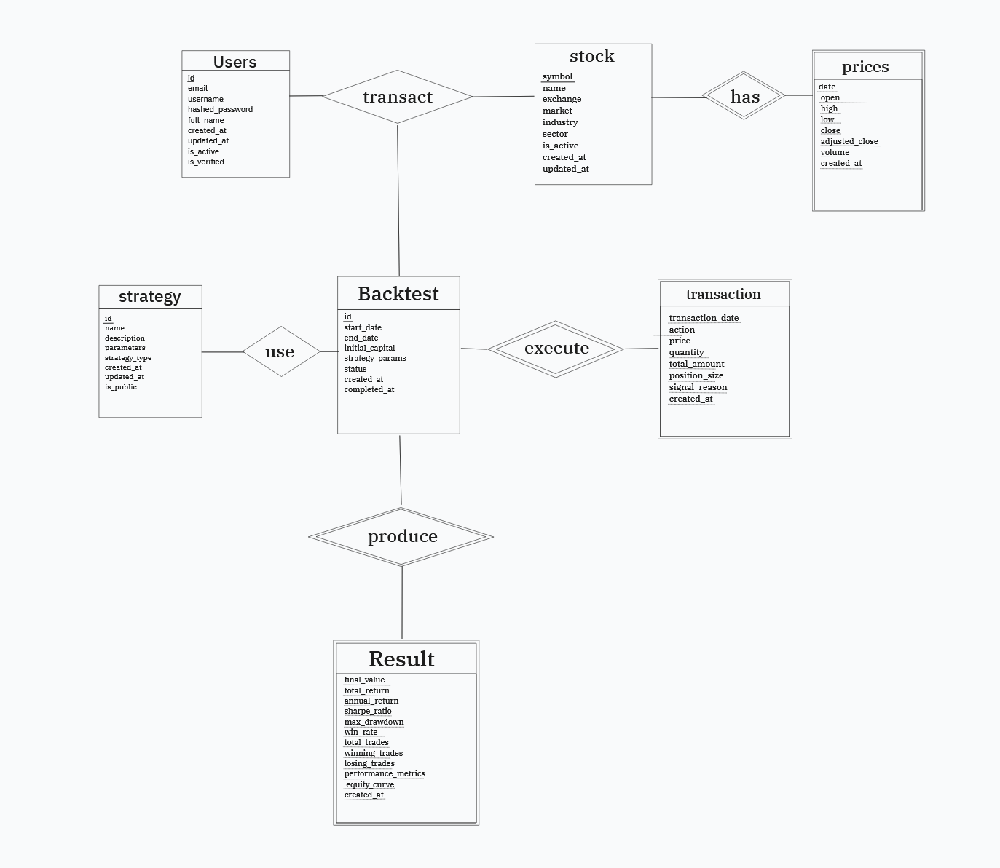

# Financial 5090

## Team Members
- 李威慶 (113550054) — Computer Science, Year 2
- 劉逸安 (113550039) — Computer Science, Year 2
- 邱昱睿 (113550111) — Computer Science, Year 2
- 張予同 (113550103) — Computer Science, Year 2

# Section 1: Project Description

## Application Overview
- **Domain:** Finance
- **Need Addressed:** Commercial investment platforms are costly for beginners, so we provide an affordable visualization tool for testing simple trading strategies.
- **Primary Users:** Individuals new to the investment market who want an intuitive way to explore how basic strategies perform.
- **Database Role:** Persist user strategies, log simulation outcomes, and expose historical stock data for analysis.

### Core Database Functions
- **Historical Price Lookup:** Users select a stock ticker and retrieve its historical price series for analysis.
- **Strategy Configuration Storage:** Users store parameterized investment strategies for future back-testing.
- **Back-Test Recording:** The system records each simulation run, including profit, loss, and trade counts, for later review.

### Motivation
- **Key Insight:** Financial markets can be intimidating for first-time investors.
- **Objective:** Offer a risk-free environment where users experiment with strategies, deepen their market understanding, and build confidence before investing real capital.

## Data Specifications

### Entities and Relationships
- **Core Tables:** `User`, `Stock`, `Strategy`, `SimulationResult`
- **Relationships:** Each user manages multiple strategies; each strategy targets one stock; each strategy produces multiple simulation results across different time windows.

### Estimated Database Size
- **Users:** ~20
- **Stocks:** ~100
- **Strategies:** ~100
- **BackTests:** ~100

### Data Acquisition Strategy (9%)
- **Primary Sources:** Public stock-market datasets (e.g., Kaggle, government open data) and proprietary APIs for real-time updates.
- **Approach:** Combine web scraping with backend API ingestion, supplementing with synthetic data when necessary to cover edge cases.

# Section 2: ER Diagram

## Conceptual Layout

## Schema Preview

  

